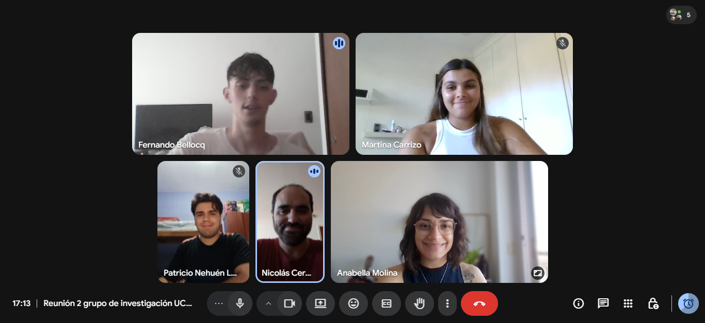

Esta página reúne las actividades previstas del equipo de investigación: los eventos académicos en los que participamos y la dinámica de trabajo semanal.

------------------------------------------------------------------------

## Congresos y eventos académicos

### Jornadas de Ciencia Política (JCP) – UBA

**Fecha:** 25 al 28 de agosto de 2026\
**Lugar:** Facultad de Ciencias Sociales, UBA – Buenos Aires, Argentina\
**Modalidad:** Presencial

El equipo prevé presentar avances de la investigación en el área de **Política Latinoamericana** y **Política Comparada**.

Más información: [jornadascpuba\@sociales.uba.ar](mailto:jornadascpuba@sociales.uba.ar)\
Sitio oficial: [cienciapolitica.sociales.uba.ar](https://cienciapolitica.sociales.uba.ar/home/comunidad/actividades-extracurriculares/jcp/)

------------------------------------------------------------------------

### XIII Congreso Latinoamericano de Ciencia Política (ALACIP 2026)

**Fecha:** 21 al 24 de julio de 2026\
**Lugar:** Universidad Torcuato Di Tella – Buenos Aires, Argentina\
**Modalidad:** Presencial\
**Lema:** *Cuatro décadas de democracia en América Latina. Entre el fortalecimiento y la erosión en un mundo incierto*

El Congreso ALACIP es el principal encuentro de ciencia política a nivel latinoamericano, organizado por la Asociación Latinoamericana de Ciencia Política (ALACIP) y la Sociedad Argentina de Análisis Político (SAAP). El equipo tiene previsto presentar resultados de investigación en el marco de este evento.

Sitio oficial: [congreso-alacip.saap.org.ar](https://congreso-alacip.saap.org.ar/)

------------------------------------------------------------------------

## Reuniones del equipo

El equipo se reúne **una vez por semana**, en un día fijo, para hacer seguimiento del avance de la investigación, discutir lecturas y coordinar tareas.

::: {style="text-align: center; margin: 1.5rem 0;"}
{fig-align="center"}
:::

Las reuniones tienen una duración aproximada de dos horas y combinan distintos tipos de actividades según la etapa del proyecto:

-   **Discusión bibliográfica:** lectura compartida y debate de textos relevantes para el marco teórico y el estado del arte.
-   **Seguimiento de datos:** revisión del estado de la base de datos, validación de fuentes y resolución de dudas de codificación.
-   **Avances individuales:** cada integrante presenta brevemente el trabajo realizado durante la semana.
-   **Planificación:** definición de tareas y plazos para la semana siguiente.

Las reuniones son de carácter virtual/híbrido, lo que permite la participación de todos los integrantes independientemente de su ubicación.
