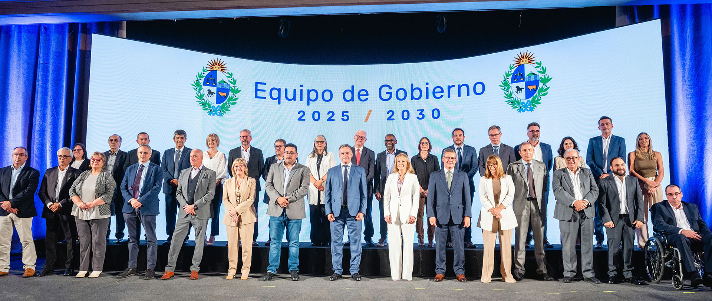
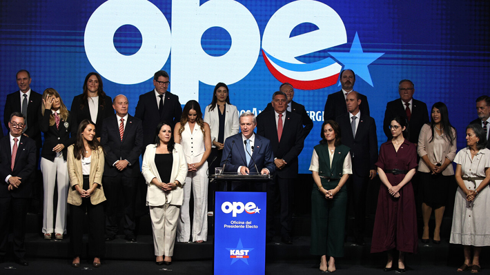

## Sobre el proyecto

Este proyecto analiza comparativamente los niveles de **partidismo ministerial** en los gabinetes presidenciales de **Argentina, Chile, Perú y Uruguay** entre 2000 y 2025.

Partimos de una pregunta central: ¿cómo influye el grado de institucionalización partidaria en la composición de los gabinetes presidenciales? Para responderla, adoptamos la tipología desarrollada por Camerlo y Castaldo (2023), que supera la clásica distinción entre ministros "partidistas" y "no partidistas" y permite capturar vínculos más matizados entre los ministros y sus organizaciones políticas.

------------------------------------------------------------------------

## ¿Por qué importa?

Los ministros no son solo agentes del presidente: son también portadores de trayectorias, lealtades e identidades partidarias. Estudiar cómo se conforman los gabinetes —quiénes son designados, con qué perfil y bajo qué lógicas— permite entender mejor cómo se ejerce el poder ejecutivo, cómo se negocian las coaliciones y cómo se articula la relación entre partidos y gobierno en los sistemas presidenciales latinoamericanos.

## Los gabinetes que estudiamos

::: {layout-ncol="2"}
{fig-alt="Foto oficial del equipo de gobierno de Uruguay 2025-2030"}

{fig-alt="Presentación del gabinete del presidente electo Kast en Chile"}

{fig-alt="Reunión de gabinete de Javier Milei en Argentina"}

{fig-alt="Foto del equipo de gobierno de Perú"}
:::

------------------------------------------------------------------------

## Hipótesis

> En contextos de **baja institucionalización partidaria**, los presidentes tienden a conformar gabinetes con alta proporción de ministros de vinculación partidaria no estándar, como forma de maximizar el control ejecutivo y minimizar los riesgos de agencia.

------------------------------------------------------------------------

## Objetivos

**Objetivo general**

Analizar los patrones de partidismo ministerial en los gabinetes presidenciales del Cono Sur, identificando regularidades, variaciones y los factores que las explican.

**Objetivos específicos**

1.  Identificar y clasificar los niveles de partidismo ministerial en Argentina, Brasil, Chile y Uruguay entre 2000 y 2025.
2.  Analizar los factores institucionales —reglas de formación de gobierno, tipo de coaliciones, institucionalización partidaria— que influyen en la composición de los gabinetes.
3.  Comparar patrones de selección ministerial entre los cuatro países, considerando las estrategias presidenciales de control, equilibrio y representación.

------------------------------------------------------------------------

## Metodología

El proyecto combina análisis documental, construcción de bases de datos biográficas y entrevistas semiestructuradas a expertos académicos y exfuncionarios de los cuatro países. La codificación de los ministros sigue la tipología de Camerlo y Castaldo (2023), que clasifica el vínculo partidario según criterios de jerarquía, consolidación y vinculación efectiva.

------------------------------------------------------------------------

## Resultados esperados

-   Una **base de datos codificada** de ministros de los cuatro países con clasificación de su nivel de afiliación partidaria.
-   Un **análisis comparado** que explique cómo las reglas institucionales, la fortaleza partidaria y los estilos de liderazgo inciden en los perfiles seleccionados.
-   Una **tipología validada empíricamente** con potencial de replicación en otros contextos de baja institucionalización.
-   Publicación de **artículos científicos** y presentación de resultados en congresos nacionales e internacionales.

------------------------------------------------------------------------

## Instituciones

Este proyecto es llevado adelante en el marco de la **Universidad Católica de La Plata (UCALP)**, Sede Bernal.

*Proyecto de investigación 2025–2026.*
